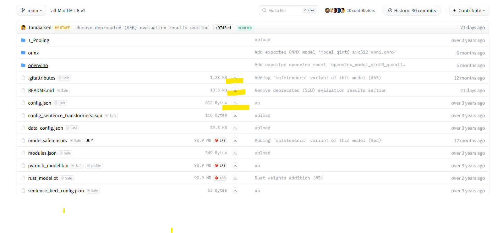
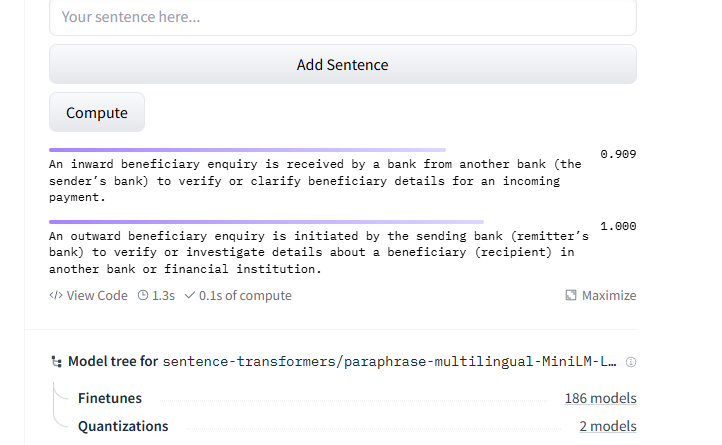

## hugging face 上的sentence transformer模型是个什么模型，为什么和其他模型相比，他的体积小很多
Hugging Face 上的 ​Sentence Transformers 是一种专门用于生成句子嵌入​（sentence embeddings）的高效模型，它的核心特点是：
将句子映射为稠密向量（dense vector），并保持语义相似性​（即相似句子的向量距离近）。

​为什么 Sentence Transformers 模型体积小？
与其他大模型（如BERT、GPT）相比，Sentence Transformers 体积小得多，主要原因如下：

1. ​基于预训练模型的蒸馏与微调
Sentence Transformers 通常基于 ​预训练语言模型（如BERT、RoBERTa）的蒸馏版本​（如 bert-base → distilbert），或直接微调轻量级模型（如 all-MiniLM-L6-v2）。
通过知识蒸馏​（Knowledge Distillation），用大模型训练小模型，保留语义能力但减少参数量。
2. ​仅保留编码器（Encoder-Only）​
原始BERT类模型包含编码器（Encoder）和解码器（Decoder），但 Sentence Transformers ​只用编码器，砍掉冗余结构。
例如：bert-base-uncased 有1.1亿参数，而蒸馏后的 all-MiniLM-L6-v2 仅3300万参数。
3. ​固定输出维度
Sentence Transformers 通过池化层​（如均值池化、CLS池化）将变长句子压缩为固定维度的向量（如384维、768维）。
传统BERT的每个token输出变长向量，而 Sentence Transformers 直接输出单一向量，节省存储。
4. ​针对嵌入任务优化
训练目标直接优化句子级语义相似度​（如余弦相似度），而非原始BERT的MLM/NSP任务，移除无关参数。
使用对比学习​（Contrastive Learning）或三元组损失​（Triplet Loss），使模型更专注语义而非语言生成。
5. ​无解码器/生成逻辑
生成式模型（如GPT）需要保留解码器和自回归逻辑，而 Sentence Transformers 只需编码，结构更简单。
​与其他模型的对比
模型类型	参数量（示例）	输出	典型用途	体积大的原因
​Sentence Transformers	30M–100M（如 all-MiniLM-L6-v2）	固定维度向量（如384维）	语义搜索、聚类、相似度计算	仅编码器+蒸馏+池化
​原始BERT	110M–340M	每个token的向量	文本分类、NER、QA	完整编码器+MLM/NSP任务
​GPT类生成模型	100M–数10B	生成文本序列	文本生成、对话	解码器+自回归结构
​T5	220M–11B	输入输出序列	翻译、摘要、生成任务	完整Encoder-Decoder架构
​为什么小体积仍能保持高性能？
​任务专注性：
Sentence Transformers 专为语义相似度优化，不需要通用语言理解的所有能力。

​蒸馏有效性：
小模型通过蒸馏学习大模型的语义关系，保留核心功能（如 paraphrase-MiniLM-L6-v2 在部分任务中接近BERT效果）。

​向量检索友好：
生成的嵌入可直接用于高效向量数据库（如FAISS、Milvus），无需实时调用大模型。

​典型应用场景
​语义搜索：将查询和文档编码为向量，用余弦相似度匹配。
​聚类/去重：如新闻文章去重。
​推荐系统：计算用户兴趣和内容的向量相似度。
​检索增强生成（RAG）​：快速从知识库检索相关文本。
​总结
Sentence Transformers 的小体积源于：
✅ ​模型蒸馏​（从大模型压缩）
✅ ​仅编码器+池化​（移除冗余结构）
✅ ​任务专用优化​（非通用语言模型）

## how to use HG offline mode?
1.fisrt download, then use local cached model
you can download model in several ways,

directly download or download via CLI or download via instance.
1.pip install huggingface_hub

2.huggingface-cli download --resume-download sentence-transformers/all-MiniLM-L6-v2 --local-dir all-MiniLM-L6-v2
huggingface-cli download --resume-download sentence-transformers/paraphrase-multilingual-MiniLM-L12-v2 --local-dir paraphrase-multilingual-MiniLM-L12-v2

3.when load model ,disable it from remote repo:
model = SentenceTransformer('all-MiniLM-L6-v2',local_files_only=True, cache_folder='C:\\Users\\alice\\all-MiniLM-L6-v2')

## 比如我定义了IBE 和OBE，但我在搜索IBE时候OBE也会返回，但其实我只想要IBE的结果， 这是为什么以及怎么处理
原因分析
​语义混淆：模型可能认为“猴子”和“西瓜”在某种上下文中相关（例如“猴子吃西瓜”），导致向量相似度高。
​嵌入质量不足：使用的 Sentence Transformer 模型未在足够区分性的数据上微调。
​搜索策略问题：向量数据库的搜索参数（如相似度阈值、Top-K 设置）未过滤低相关性结果。

解决方案：
选择更专业的模型； ​自定义微调：-->这个是从模型层面
​增强输入文本的区分性， 为关键词增加跟多的标签 -->这样模型就会关注跟多的类别差异
调整搜索策略：设置相似度阈值，高于这个值结果才返回（TOPK）
向量数据库优化： 这个比较难，一般做不来，也不做。。

总之核心思想就是拉开词语在向量空间的距离。。

但是看哦，直接在HG上计算相似度也非常高。。

## FAISS数据库
在使用 ​FAISS 时，生成的向量数据默认是存储在内存中​（除非显式保存到文件）。FAISS 本身是一个高性能的内存索引库，不提供内置的图形化界面（UI）
调用 faiss.write_index() 保存到磁盘
还有一点要注意的，不要重复写入，重复写入会加大某个的权重，要做去重处理，不介意内存的话就不要落盘

## Collection knowledge already exists 
错误时，说明你尝试在 ChromaDB 中创建一个已存在的集合（Collection）
如果之前运行过代码创建了同名集合（knowledge），再次运行时会报此错误
要删除已经存在的集合：

import chromadb
client = chromadb.PersistentClient(path="ollama_rag_db")
if "knowledge" in [col.name for col in client.list_collections()]:
    client.delete_collection("knowledge")
collection = client.create_collection(name="knowledge")

## important NOTES for sql agents
1.Local models may require more precise prompting than cloud models
2.SQL-specific models (like sqlcoder) generally perform better than general-purpose models
3.Always test with non-destructive queries first
4.For production use, consider adding query validation layers
5.You may need to adjust the prompt based on your specific model's capabilities